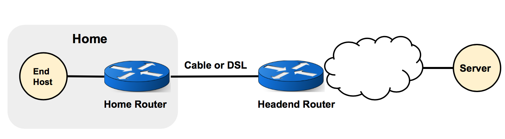

# 环境准备

本次lab建议大家在虚拟机环境上完成，需要有linux环境。我们提供了vagrant安装配置虚拟机的方法，仅供参考，也可自己另外安装虚拟机自行装包，需要的包可参考```Vagrantfile```。

# PART A：套接字编程

套接字编程是编写通过网络通信的程序的标准方法。 虽然最初是为用 C 编程的 Unix 计算机开发的，但套接字抽象是通用的，不依赖于任何特定的操作系统或编程语言。 这允许程序员在许多情况下使用套接字来编写正确的网络程序。

这部分作业将为你提供基本套接字编程的经验。你将编写2对 TCP 客户端和服务器程序，用于通过 Internet 发送和接收文本消息。一对客户端/服务器必须用 C 编写。另一对可以用 Python 或 Go 编写，你需要从 Python 和 Go 中选择一种作为第二对客户端/服务器的实现语言。

两种语言的客户端和服务器程序应满足相应的规范，请务必在编程前后仔细阅读这些内容，以确保你的实现满足它们。

## Server 规范

- 每个服务器程序都应该监听一个套接字，等待客户端连接，从客户端接收消息，将消息打印到标准输出，然后无限期地等待下一个客户端连接。
- 每个服务器都应采用一个命令行参数：侦听客户端连接的端口号。
- 每个服务器应该在无限循环中接受和处理客户端通信，允许多个客户端向同一服务器发送消息。 服务器应该只在响应外部信号时退出（例如，按下 ctrl-c 的 SIGINT 时）。
- 每台服务器应维护一个短的（5-10）客户端队列并按顺序处理多个客户端连接尝试。在现实生活中的实际应用程序中，TCP 服务器会派生一个新进程来同时处理每个客户端连接，但这并不是本次作业中你需要做的。
- 每个服务器都应该适宜地处理可能由套接字编程库函数返回的错误值（请参阅下面每种语言的详细信息），处理客户端连接相关的错误不应导致服务器在处理错误后退出，所有其他的处理都是这样。

## Client 规范

- 每个客户端程序应该连接服务器，从标准输入读取消息，发送消息，然后退出。
- 每个客户端都应该按照它在标准输入中的显示方式读取和发送消息，直到到达 EOF（文件结尾）。
- 每个客户端都应该接受两个命令行参数：服务器的 IP 地址和服务器的端口号。
- 每个客户端必须能够通过循环迭代来读取和发送消息块来处理比较大的消息，而不是直接先将整个消息读入内存。
- 每个客户端应通过尝试重新发送其余数据直到全部发送完来处理部分发送（当套接字仅传输上次发送调用中给出的部分数据时）。
- 每个客户端都应该适宜地处理可能由套接字编程库函数返回的错误值。

## 编程指导和参考资料

你需要在之前用 Vagrant 创建的虚拟机上进行所有的代码编译、运行和测试。 你可以直接在虚拟机上编写代码（比如使用 Vim 文本编辑器）或直接在你的主机操作系统上使用任何你喜欢的编辑器进行编写（因为我们已经设置了虚拟机和主机之间的共享文件夹）。 从终端运行 vagrant ssh 后，你应当已经处在 /vagrant 课程目录下了。

我们在 client_server/ 目录中提供了代码框架。 在开始编程之前，你应该阅读并理解此代码。你应该只在标有 TODO 注释的所提供文件的位置进行编程。 每个客户端一个 TODO 部分，每个服务器一个。 你可以根据需要添加函数，但不要更改文件名，因为它们将用于自动化测试。

以下部分提供了每种语言的客户端和服务器程序的参考资料。

### C

可以参考经典的[Beej 网络编程指南](https://beej.us/guide/bgnet/html/)。其中的 [System Calls or Bust](https://beej.us/guide/bgnet/html/#system-calls-or-bust) 和 [Client-Server Background](https://beej.us/guide/bgnet/html/#client-server-background) 部分将是与本次作业最相关的。[Man Pages](https://beej.us/guide/bgnet/html/#man-pages)对于查找单个函数（例如 socket）也很有用。

文件 client-c.c 和 server-c.c 已经包含了代码框架。你需要在标记为 TODO 的位置添加套接字编程和 I/O 代码。一般来说你可能需要在每个文件的 TODO 部分中插入大约 70 行代码（有较好的注释和间隔）。你的实现可以更短或更长。

对于错误处理，可以为设置全局变量 errno 的套接字编程函数调用 perror（Beej 指南会告诉你执行哪个操作）。对于那些不这样做的同学，只需将消息打印到标准错误即可。

你应该通过在 client_server 目录中运行 make 来构建你的解决方案。你的代码必须使用提供的 Makefile 构建。服务器应该运行为 `./server-c [port] > [output file]`。客户端应该运行为 `./client-c [server IP] [server port] < [message file]`。有关详细信息，请参阅本文档的“测试”部分。

### Python

这里是 Python socket 编程的[文档链接](https://docs.python.org/2/library/socket.html)。[socket objects](https://docs.python.org/2/library/socket.html#socket-objects) 的顶部的前几段和 [example](https://docs.python.org/2/library/socket.html#example) 的全部内容与本次作业特别相关。

文件 client-python.py 和 server-python.py 已经包含了代码框架。 你需要在标记为 TODO 的位置添加套接字编程代码。一般来说你可能需要在每个文件的 TODO 部分中插入大约 15 行代码。你的实现可以更短或更长。

Python 套接字函数将自动引发异常并提供有用的错误消息。不需要额外的错误处理。

服务器应该运行为 `python server-python.py [port] > [output file]`。 客户端应该运行为 `python client-python.py [server IP] [server port] < [message file]`。 有关详细信息，请参阅本文档的“测试”部分。

### Go

这里是 Go socket 编程的[文档链接](https://golang.org/pkg/net/)，顶部的概述和关于 [type Conn](https://golang.org/pkg/net/#Conn) 的部分与本作业是最相关的。

文件 client-go.go 和 server-go.go 已经包含了代码框架。 你需要在标记为 TODO 的位置添加套接字编程代码。 一般来说你可能需要在每个文件的 TODO 部分中插入大约 40 行代码。你的实现可以更短或更长。

Go Listen 函数默认维护一个连接客户端队列。 不需要额外的编程。

你应该通过在 `client_server` 目录中运行 `make go `来构建你的解决方案。 你的代码必须使用提供的 Makefile 构建。 服务器应该运行为 `./server-go [port] > [output file]`。 客户端应该运行为 `./client-go [server IP] [server port] < [message file]`。 有关详细信息，请参阅本文档的“测试”部分。

## 测试

你应该通过尝试将消息从客户端发送到服务器来测试你的实现。服务器可以在后台运行（将 & 附加到命令中）或在单独的 SSH 窗口中运行。你应该使用 127.0.0.1 作为服务器 IP，并使用介于 10000 和 60000 之间的服务器端口号。你可以使用 fg 命令将其带到前台然后按 ctrl-c 将其杀死。

Bash 脚本 `test_client_server.sh` 将通过尝试在客户端和服务器的所有 4 种组合（C 客户端到 C 服务器、C 客户端到 Python/Go 服务器等）之间发送几个不同的消息来测试你的实现。 消息如下：

1. 短信“Go Tigers!\n”
2. 一条长的、随机生成的字母数字消息
3. 一条长的、随机生成的二进制消息
4. 多条短信从不同的客户端依次发送到一台服务器
5. 几条长的、随机的字母数字消息从不同的客户端并发发送到一台服务器

> Note: 以上内容为测试脚本覆盖的测试点范围，除此之外还需要实现一个长TCP流（300s以上）来完成PART B任务。

运行脚本：

```./test_client_server.sh [python|go] [server port]```

如果你收到权限错误，请运行 `chmod 744 test_client_server.sh ` 以授予脚本可执行权限。

对于每个客户端/服务器对，如果消息发送和接收正确，测试脚本将打印“SUCCESS”。 否则，如果 diff 输出是人类可读的，即仅用于测试 1 和 4，它将打印发送和接收消息的差异。

确保在运行` test_client_server.sh` 之前通过 ```make``` 编译你的客户端/服务器对。

## 调试提示

这里有一些调试技巧供参考。 

- 代码框架中定义了缓冲区大小和队列长度常量，你可使用它们，但如果它们未在特定文件中定义，则说明不需要它们。但如果不是这两种情况其中之一，则要么你硬编码了一个值，这是不好的方式，要么你可能做错了什么。
- 在 C、Python 和 Go 中，有多种方法可以从 stdin/stdout 读取和写入。任何方法都是可以接受的，只要它不会一次无限量读入内存并且不会修改消息。
- 如果你使用缓冲 I/O 写入stdout，请确保调用flush，否则可能无法写入长消息的结尾。
- 请记住在客户端程序结束时关闭套接字。
- 测试时，确保使用 127.0.0.1 作为客户端的服务器 IP 参数，并且客户端和服务器程序使用相同的服务器端口。
- 如果你收到“地址已在使用”错误，请确保你还没有运行服务器。否则，使用命令 logout 和 vagrant ssh 重新启动你的 ssh 会话。
- 如果你遇到其他连接错误，请尝试使用介于 10000 和 60000 之间的不同端口。

## FAQ

* 我应该在recv() 上设置MSG_WAITALL 标志吗？ 不用，这会导致 recv() 在接收到指定数量的数据之前不会返回。但是，服务器不能提前知道这个数量，所以你应该继续调用 recv() 直到没有任何东西可以接收。
* 当用户按下 ctrl-c 时，我是否需要处理诸如SIGINT这样的信号来清理服务器进程？ 不需要，在这个任务中没有必要，对信号的默认响应已经足够好了，当然这样做没有问题。
* 我应该使用流套接字还是数据报套接字？ 请使用流套接字，以确保传递消息的准确，不保证传送的是数据报包。
* 客户端是否应该等待接收来自服务器的回复？ 不需要，在这个作业中，在发送完所有数据后它应该立即退出。
* 服务器是否应该（在不同的进程中）同时处理客户端连接？ 不用，正如客户规范中所述，本作业不需要这样做。 所以不需要使用 fork() ！
* 我可以只选择 Python 和 Go 吗? 不可以，C 客户端/服务器是必须的。 在这之外，还应该在 Python 或 Go 中提交另一个客户端/服务器，但不能同时提交！ 如果你同时提交了 Python 和 Go，我们只会对你的 Python 文件进行评分。此外，你的第二对客户端/服务器对必须使用相同的语言，也就是，不能提交 Python 的客户端和 Go 的服务器，或者相反。


# PART B：TCP 拥塞控制和 Bufferbloat

在本作业中，你将创建自己的模拟网络，以动态地研究TCP，以及网络操作员看似微不足道的配置决策是如何对网络性能产生重大影响的。

TCP是一种在不可靠的分组交换网络上获得可靠传输的协议。TCP的一个重要组成部分是拥塞控制算法，比如限制终端主机发送速率，以防止网络基础设施不堪重负的流量。

然而，即使终端主机使用TCP，网络也会遇到拥塞相关的性能问题。当路由器和交换机上的包缓冲区过大时，就会出现Bufferbloat的问题。

本次任务将使用Mininet(一个很有用的网络实验工具)来模拟一个小型网络，并收集与TCP拥塞控制和Bufferbloat相关的各种性能统计数据。这将允许你推断TCP和路由器配置对网络性能的影响。

## 背景

#### TCP拥塞窗口
TCP拥塞窗口大小参数，通常简写为“cwnd”，由发送方维护，并决定在任何时候有多少流量可以处于未完成状态(已发送但未被确认)。在TCP运行过程中，控制cwnd的值有很多算法，它们的目标都是在防止拥塞的同时最大化连接的吞吐量。

#### Bufferbloat
Bufferbloat是这样一种网络现象：网络中的交换设备使用了过大的缓冲区，进而导致高延迟和包延迟变化(抖动)。这种现象甚至可以发生在一个典型的家庭网络，如以下:

在图中，家庭网络中的终端主机连接到家庭路由器。然后，家庭路由器通过电缆或DSL连接到由互联网服务提供商(ISP)运行的路由器。通过在Mininet中模拟和试验一个类似的网络，你将观察到bufferbloat是如何导致网络性能低下的。

#### Mininet
Mininet是一个网络模拟器，你可以使用它创建一个自定义的网络虚拟主机，交换机，控制器和链路，所有在一台计算机上。仿真网络中的虚拟设备可以运行真实的程序;任何可以在linux上运行的东西也可以在Mininet设备上运行。这使得Mininet成为快速、简单地模拟网络协议和测量的有价值的工具。

首先，使用Mininet的Python API创建以下网络，这是一个典型的家庭网络:

图中h1是一个网络服务器，有一个高带宽连接(1Gb/s)到你的家用路由器。家用路由器的下行连接速度较慢(1.5Mb/s)。往返传播延迟，即h1和h2之间的最小RTT(round-trip time)为20ms。路由器缓冲区(队列)大小将是这个模拟中的自变量。

在Mininet中创建自定义网络拓扑，我们扩展了Mininet.topo.Topo类。我们已经将交换机(路由器)添加到了网络中。你只需要添加h1、h2和具有适当特征的链接，以创建上面图像中指定的设置。Mininet指南的[使用Mininet](https://github.com/mininet/mininet/wiki/Introduction-to-Mininet#creating)部分的前几个小节描述了如何向网络拓扑中添加元素和设置参数。

> Note：lab内容主要以python为例进行说明

## 方式一： jupyter

在虚拟机中，执行 ```sudo jupyter notebook &``` 命令。这将在后台启动新的 Jupyter Notebook 服务器。即使是这样在后台运行，它有时也会将信息消息打印到终端。要关闭 Notebook，运行 ```fg```，然后按 Control-C 两次。

当 Notebook 在运行时，在你的主机上打开浏览器，在地址栏中输入' 127.0.0.1:8888 '。这将能够带你去 Jupyter Notebook 的文件选择窗口。Juypter Notebook 是运行在虚拟机的8888端口上的，但是你可以通过你的主机访问它，因为我们已经做了虚拟机和主机之间的端口转发。打开 bufferbloat.ipynb，并在这个Notebook 的指导下完成剩下的任务。

## 方式二：自定义实现

任务不限制实现方式，也可以用其他方式实现，要求如下：

* 需要使用mininet创建一个模拟网络环境
* 启动cwnd窗口大小监测
* 启动队列监测
* 使用自己实现的client、server启动一个长生命周期的TCP流
* 启动ping消息队列
* 启动Web服务器
* 周期性地从h1下载index.html网页，并测量所需时间
* 将测量结果使用图表表示出来

> Note: 有疑问可参考jupyter文件